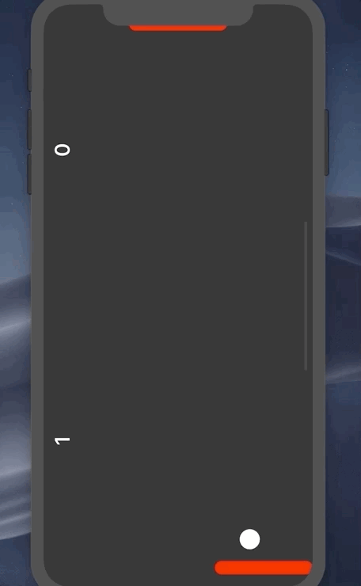

## SoloProjectPong
A creation of the classic game "Pong" with the ability to play with friends locally.
Each player can take control of a paddle and battle with each other on the same device. The game keeps count of said score, first player to ten wins!
## Installation 
Simply copy the files from this open source project onto your local computer, and run the program. 
I suggest using the copy feature on the top right of the GitHub page. 
## App In Use
 
## Requirements
- An IOS Device 
- IOS 8.0 or greater
